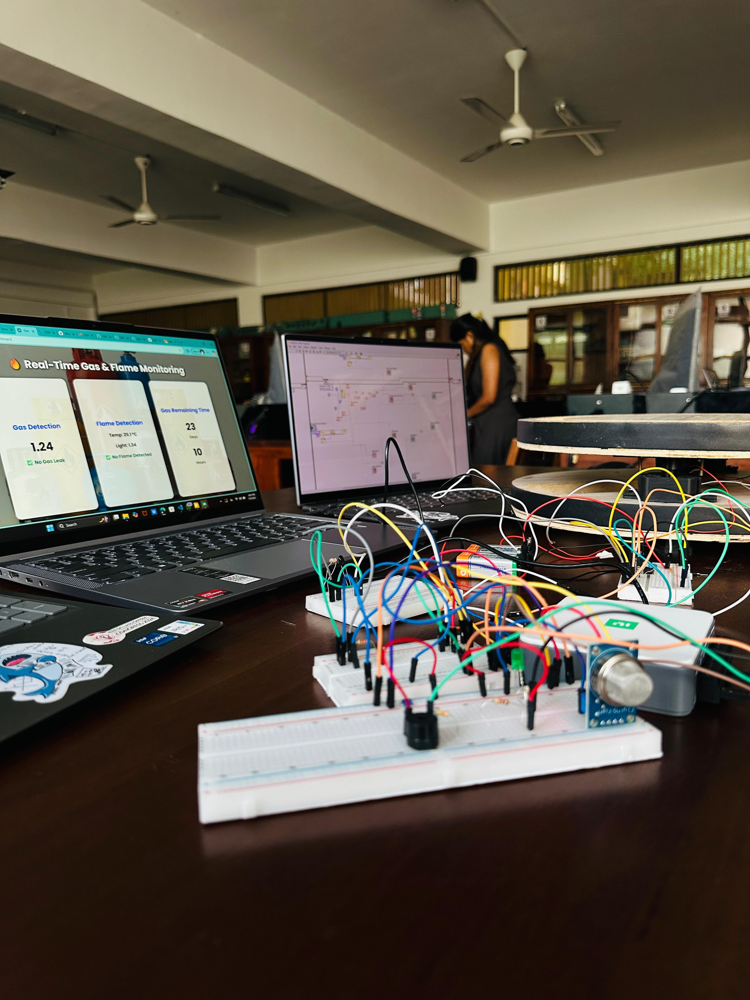
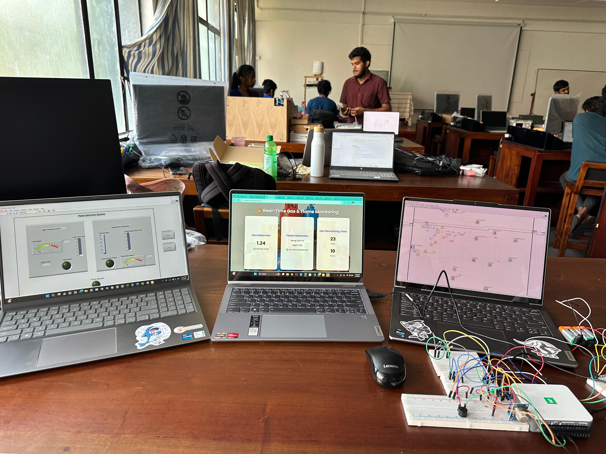

# Real-Time LPG Gas & Flame Detection System 

This repository contains the design and implementation of a **real-time LPG gas and flame detection system** using MQ2 and flame sensors, a National Instruments DAQ card, and LabVIEW for data acquisition and processing. The project integrates **Python scripts** via LabVIEW Python nodes and features a custom-built **web dashboard** for live monitoring.  

---

## Project Overview
- **Sensors Used:** MQ2 (LPG/Smoke detection), Flame sensor  
- **DAQ:** National Instruments DAQ card  
- **Software:** LabVIEW (for real-time acquisition & processing)  
- **Integration:** LabVIEW Python nodes for seamless data handling  
- **Dashboard:** Custom web interface built with HTML, CSS, and Python  

---

##  Features
- Real-time monitoring of **LPG gas concentration**  
- **Flame detection** with instant alerting  
- **Python integration in LabVIEW** for advanced processing  
- Web dashboard displaying:
  - Gas levels
  - Flame alerts
  - Estimated gas refill timing  

---

## 🛠 Tech Stack
- **LabVIEW** → DAQ integration and signal processing  
- **Python** → Data processing scripts integrated with LabVIEW  
- **HTML + CSS + Python (Flask/Django/FastAPI)** → Web dashboard  
- **MQ2 Sensor + Flame Sensor** → Data acquisition hardware  

---

## 📸 System Previews

---

 
